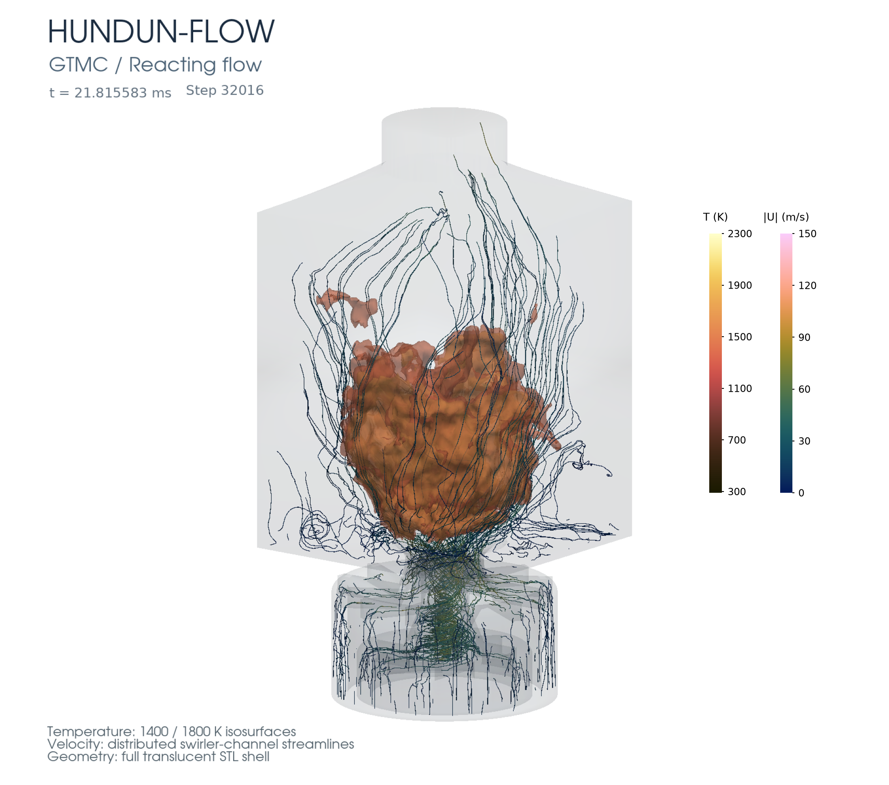
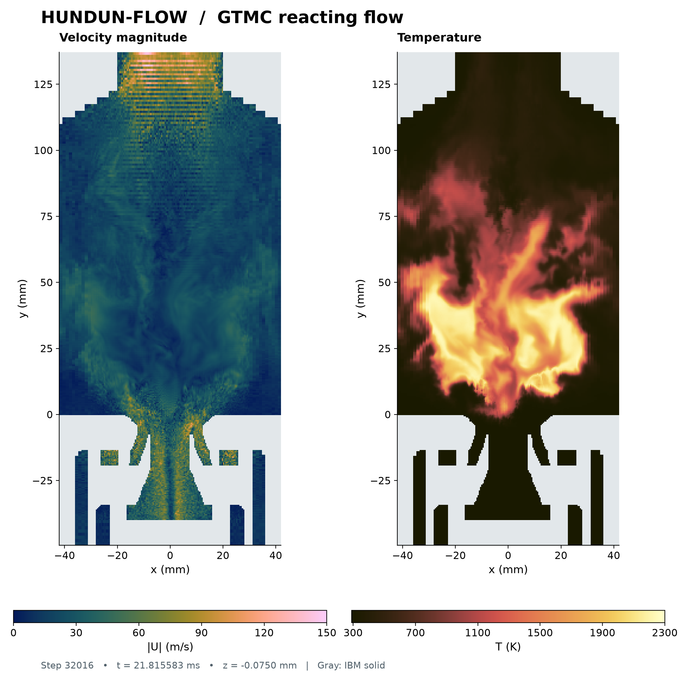

# HUNDUN-FLOW

[English](README.md) | 简体中文

近年来，AI 技术推动了湍流燃烧建模研究和数值模拟技术的发展，研究者可以将物理认识与模型构思快速转化为算法和程序模块。针对湍流燃烧模型创新向真实燃烧室数值模拟转化所面临的多物理过程耦合、数值算法集成与软件架构协同难题，开发开源燃烧室模拟软件 HUNDUN-FLOW，为研究者快速实现与系统验证模型构想、构建自主可扩展的科研软件体系提供计算基础。

HUNDUN-FLOW 面向湍流燃烧数值模拟研究，采用 C++17 和 MPI 开发，以笛卡尔网格、局部重构浸没边界方法（IBM）和 CN/BE 外迭代压力耦合为基础，组织 LES、PaSR/TCR-TPDF 与拉格朗日喷雾模型。研发目标包括局部加密、几何自动标记及面向真实燃烧室的多物理过程模拟。软件采用 Apache License 2.0，支持研究者按照许可条款开发、使用和分发自己的衍生程序，并自主选择衍生代码的开放方式。

软件的命名来自《山海经·西山经》，其中以“其状如黄囊，赤如丹火”描述帝江。HUNDUN-FLOW 将其工程化地理解为一个由边界包围的囊状密闭腔体，内部承载湍流流动与燃烧化学反应相互作用的多物理过程，这一意象与燃烧室数值模拟相呼应。另外，“浑敦”同时表示有待分解和建模的复杂整体，数值模拟的任务是从这种复杂性中建立物理认识。

[v1.1.0](https://github.com/windcicada/Hundun-Flow/releases/tag/v1.1.0) 面向固定笛卡尔网格、静态浸没边界与稀相计算液滴。本版检查覆盖选定的流动、输运、化学、动态微观混合、气液交换和续算组合；燃烧室长时间计算与统计评价按独立算例开展，已有证据见[版本验收范围](docs/accept.md)。

## 程序架构

源码采用扁平布局，按职责划分模块。公共头文件位于 `versions/v0.4/include/hundun`，实现位于 `versions/v0.4/src`。目录名称沿用实现历史，产品版本由根目录的 `VERSION` 定义。

| 层次／源码前缀 | 主要职责 | 接口边界 |
| --- | --- | --- |
| 应用层：`app_*` | 解析算例输入、编译执行计划、提供命令行接口并记录构建身份。 | 算例准备阶段确定模型选择与资源需求。 |
| 状态与调度层：`core_*` | 管理字段、工作区、时间历史、产品驱动及耦合时间步的接受。 | 配置要求的检查在全部 MPI 进程通过后，尝试状态转为已接受状态。 |
| 物理模型层：`models_*` | 实现燃烧闭合、ESF、微观混合、化学适配器和计算液滴内核。 | 通过普通值、借用视图和查询服务获取输入，返回候选变化与报告。 |
| 物性服务层：`physics_*` | 提供热力学、输运性质、LES 闭合与源项接口。 | 状态版本和材料身份限定物性与源项的有效范围。 |
| 离散方程层：`solver_*` | 组装动量、压力、焓和标量方程，调用线性求解器及预条件器。 | 离散算子使用网格度量、边界状态和一致的面通量。 |
| 网格与边界层：`mesh_*`、`bc_*` | 生成笛卡尔网格、查询几何、准备 IBM 重构并施加物理边界条件。 | 几何与重构计划向离散方程提供边界数据。 |
| 通信层：`parallel_*` | 管理 CPU 资源、Halo 交换及跨分区供体通信。 | 预先建立的通信计划规定所有权、缓冲区和完成条件。 |
| 持久化与输出层：`io_*` | 输出云图、检查点、监控量和运行证据。 | 输出对应已接受状态；续算核对状态、资产和方法历史。 |

## 数值方法

### 网格、输运与压力耦合

计算期间网格保持固定，可采用均匀或拉伸的笛卡尔间距。STL 表面或导入的笛卡尔网格标记定义静态浸没边界，局部重构提供边界邻近状态。自适应重构阶次指固定网格上的插值阶次选择。

| 组成 | 方法与作用 |
| --- | --- |
| 空间离散 | 采用单元中心有限体积法和 Rhie–Chow 面通量构造连接压力与速度；IBM 重构提供近壁值。 |
| 时间积分 | 默认 CN/BE 采用 Crank–Nicolson（CN）推进动量，以后向欧拉（BE）推进反应标量。普通单流体焓采用 CN；反应与喷雾组合的焓和组分采用 BE。 |
| 压力耦合 | CN/BE 使用 `outer_corrected`；显式选择 `backward_euler` 时采用 PISO 或 SIMPLE 调度。耦合检查依据原离散方程。 |
| LES | Smagorinsky、WALE 和 Vreman 闭合提供亚格子（SGS）黏度。随附反应流示例采用 Vreman。 |
| 组分与焓 | 独立组分字段恢复完整组成。总热化学焓包含物种生成焓，物性查询据此恢复温度与输运性质。 |
| 线性求解 | 迭代求解器采用配置的迭代预算，并报告独立计算的残差；输运系数与预条件器复用减少重复装配。 |

### 燃烧与微观混合

湍流–化学闭合与化学表示分别配置。闭合标识为 `finite_rate_mean`、`pasr_algebraic_v1` 和 `esf_tpdf`。`direct_cantera` 提供反应后端，`analytic_isomer` 为受控测试提供解析化学选项。

| 组成 | 方法与耦合 |
| --- | --- |
| 平均态有限速率 | 在平均热化学状态上积分化学反应，并登记组分源项，作为平均态有限速率基线。 |
| 代数 PaSR | 结合具名化学时间尺度与混合时间尺度计算反应比例，以同一比例作用于全部反应物种贡献及相应放热收支。时间尺度不可用时返回明确状态。 |
| TPDF／ESF | 以随机组成场集合表示输运概率密度函数（TPDF），每个空间 MPI 进程持有全部局部随机场。生产入口检查覆盖 2、4、8、16 场，实际准入同时受组分数与内存限制。 |
| 微观混合 | 与均值交换（IEM）提供基础混合算子；湍流–化学递归（TCR）模型根据反应率信息恢复混合状态参数，提供具有历史依赖的混合控制。 |
| 动态 TCR | `cdphyso_dynamic_v1` 和 `dyn711_v1` 分别保留各自的反应率统计与更新时序。`experimental` 应用已接受控制量，`shadow` 记录动态历史并沿用基础 IEM。 |
| 化学服务 | 公共热力学与动力学接口提供状态恢复、反应率查询和区间积分，预先准备的批量工作区复用后端资源。机理身份包括相、组分顺序及配置的反应率延拓。 |

PaSR 采用标量耗散形式的混合时间尺度：

$$
\tau_{\mathrm{mix}}=\frac{C_Z\Delta^2}{2(D+D_t)},
\qquad D_t=\frac{\nu_t}{Sc_t},
\qquad \kappa_{\mathrm{PaSR}}=\frac{\tau_{\mathrm{chem}}}{\tau_{\mathrm{chem}}+\tau_{\mathrm{mix}}}.
$$

其中，$C_Z$ 为显式模型系数，$\Delta$ 为滤波尺度，$D$ 为分子扩散率，$\nu_t$ 为 SGS 运动黏度，$Sc_t$ 为湍流 Schmidt 数。化学时间尺度的定义属于所选模型合同。PaSR 反应比例 $\kappa_{\mathrm{PaSR}}$ 与 TCR 混合状态参数 $\kappa$ 分别具有各自的定义与作用。

当前 CN/BE 的 ESF 调度先完成输运、成对 Wiener 随机增量、隐式 IEM 混合与化学，再执行流动校正。外迭代复用化学推进后的状态。物理随机场均值承载组分与焓，独立的 `field0` 为压力耦合提供降噪状态。TCR 统计按所选模型的时序更新，已接受历史参与共同时间步决策。具体合同见 [ESF 配置](docs/esf.md)和 [TCR 定义](docs/tcr.md)。

### 拉格朗日喷雾

每个计算液滴（parcel）代表带权重的一组单组分液滴。稳定 ID 连接注入、破碎、迁移与续算记录，气相采样和源项沉积将液滴运动与欧拉场耦合。

| 过程 | 方法与收支 |
| --- | --- |
| 注入与轨迹 | 注入候选保留确定性身份；自适应液滴子步处理跨单元、撞壁、出口与蒸发终止事件。 |
| 动量与传递 | Schiller–Naumann 阻力使用当地气液物性，传热传质采用所选蒸发表述的关系式；撞壁反弹依据静态几何交点及表面法向。 |
| 蒸发 | `abramzon_sirignano` 和 `thick_exchange` 分别选择 Abramzon–Sirignano 与 THICK_EX 表述；液体物性、蒸气组分映射和液相绝对焓共用明确的材料参考。 |
| 破碎 | `tab` 选择 Taylor 类比破碎（TAB）模型，`stochastic_sgs` 选择 SGS 暴露历史模型；母滴替换、子滴 ID 与模型历史先进入候选状态。 |
| 双向交换 | 计算液滴的质量、动量、焓与动能变化共同定义气相交换。每份物理交换只计一次，各 ESF 接收同一气相源。 |
| 迁移与持久化 | 根据轨迹终点所有权执行 MPI 迁移，液滴状态和历史与气相共同接受或拒绝，并保存在原生续算记录中。 |

液体物性约定与蒸发细节见[液相物性说明](docs/liquid.md)。

## 设计依据

| 设计选择 | 数值或软件依据 |
| --- | --- |
| 公共守恒收支 | 统一组分、元素、动量和能量定义，使化学与相间源项可追溯；原始预算缺陷与离散方程残差分别记录。 |
| 时间步的一致提交与回退 | 流场、随机场、模型时钟和计算液滴对应同一已接受时间端点；尝试被拒绝时保留上一步状态用于重试。 |
| 显式模块合同 | 状态版本、单位、材料身份、借用视图与工作区容量定义每次调用，支持独立模型测试并限定代码修改范围。 |
| 确定性随机身份 | 计数器随机数、稳定液滴 ID 与已接受步时钟保持重试身份，并支持跨分区续算检查。 |
| 预先准备的执行计划 | HUNDUN 工作区和通信缓冲区在使用前准备；公共输运装配、预条件器复用与批量化学减少重复工作，第三方资源行为按后端单独管理。 |
| 面向 coding agents 的开发 | 具名接口、算例检查、贡献规则和运行证据，使 coding agents 与人工开发使用相同的可核查数值合同。 |

## 构建与运行

### 运行包

[v1.1.0 发布页](https://github.com/windcicada/Hundun-Flow/releases/tag/v1.1.0) 提供源码、Linux x86-64 运行包和示例包，以及验收说明、依赖许可和 `SHA256SUMS`。运行包包含配套 MPI 与化学依赖。解压后在运行包目录执行：

```sh
./run --version
./run check case
./mpirun -n 2 ./run run case --restart restart --output next --steps 1
```

### 源码构建

文档中的 Release 组合采用 CMake 3.21+、Ninja、Clang 15、lld、libstdc++ ABI1、MPI 3+、FP64 和 ThinLTO。`HUNDUN_CANTERA_ROOT` 指向项目固定且经过哈希校验的 Cantera 3.2.0 SDK，其 Linux x86-64 构建面向 glibc 2.35 及以上环境。配置前通过 `PATH` 选定对应的 `clang` 和 `clang++`。

在仓库根目录执行：

```sh
HUNDUN_CANTERA_ROOT=/path/to/cantera cmake --preset release
cmake --build --preset release -j 2
export PATH="$PWD/b3/versions/v0.4:$PATH"
hundun --version
```

### 新算与续算

生成起始算例，检查编译后的计划，再执行短计算：

```sh
hundun init-case --output case
mpiexec -n 4 hundun check case --dry-plan
mpiexec -n 4 hundun run case --output run --steps 10 \
  --output-interval 0 --restart-interval 10 --diagnostics-interval 1
```

`hundun check` 报告时间格式、压力耦合、模型选择与资源计划。默认 CFL 目标为 0.30，保持区间为 0.25–0.35；算例中的显式配置优先。算例检查核对配置及资源准入，数值验证采用各算例规定的观测量与容差。

从保存状态继续计算，并使用新的输出目录：

```sh
mpiexec -n 2 hundun run case --restart run/Restart --output next \
  --steps 10 --output-interval 0 --restart-interval 10 --diagnostics-interval 1
```

原生 Restart 保留字段、时间历史、面通量、随机场、模型时钟和计算液滴，并在 MPI 进程数变化时采用文档规定的重分区路径。算例及物理资产保持原有身份。详细操作见[安装、运行与续算](docs/run.md)。

| 运行输出 | 用途 |
| --- | --- |
| `monitor.jsonl` | 时间步控制、方程迭代和模块耗时。 |
| `diagnostics.jsonl` | 质量、组分、元素和能量收支。 |
| `evidence.jsonl` | 程序、输入和已接受状态身份。 |
| `Restart/` | 经校验的检查点世代，用于续算。 |

## 模型示例

| 示例 | 配置 |
| --- | --- |
| [GTMC 气相模型](examples/g/README.md) | 甲烷 JL4 机理、四场 ESF、Vreman 与动态 TCR。 |
| [624CF 气液模型](examples/cf/README.md) | 煤油四步反应、两场 ESF、Vreman、动态 TCR、静态 IBM、THICK_EX 蒸发、SGS 破碎与固定热力学压力。 |

两套目录提供小型原生模型演示及新算、续算命令。完整燃烧室几何与长时间参考计算采用各自的输入和验收记录。

## GTMC 燃烧场展示

以下图像来自 GTMC 原生续算的已接受第 32016 步，$t=21.815583$ ms，网格为 $153\times325\times151$。该快照采用甲烷 JL4 机理、四场 ESF/TPDF、IEM、Vreman 与静态 IBM，用于展示瞬时流场；统计评价与发布验收分别保留证据。[图像来源](docs/hot.md)记录了原始状态及绘图检查。

三维图组合了半透明燃烧室几何、1400 K 与 1800 K 温度等值面，以及按合速度着色的瞬时流线。



中央截面位于 $z=-0.075$ mm，展示合速度及由物理平均焓和组分恢复的温度，灰色区域表示 IBM 固体。截面保留原始网格分辨率，三维图沿各轴每隔一个单元采样。



## 文档与贡献

| 主题 | 参考 |
| --- | --- |
| 安装、算例检查、运行与续算 | [运行说明](docs/run.md) |
| 发布内容与验证范围 | [发布说明](docs/release.md)、[验收记录](docs/accept.md) |
| 化学与材料定义 | [反应率延拓](docs/chem.md)、[液相物性](docs/liquid.md) |
| 随机场与微观混合 | [ESF](docs/esf.md)、[动态 TCR](docs/tcr.md) |
| 开发规则与贡献来源 | [仓库规范](AGENTS.md)、[贡献说明](CONTRIBUTING.md)、[开发者来源证明](DCO.md) |

上述模型与开发文档在仓库中维护，目前以中文为主。贡献需明确记录来源，并附 DCO 签署（`git commit -s`）。

## 许可证

HUNDUN-FLOW 采用 [Apache License 2.0](LICENSE)。在满足适用许可条款的前提下，衍生程序可采用开源或闭源许可。第三方依赖保留各自的许可证，见 [THIRD_PARTY.md](THIRD_PARTY.md)。
