# HUNDUN-FLOW Stage 4--6 Linux CPU v1 Integration Plan

> **For agentic workers:** REQUIRED SUB-SKILL: Use `superpowers:executing-plans`
> for the default serial path. Use `superpowers:subagent-driven-development` only
> after the user explicitly authorizes parallel execution at a stage node. A worker
> executes only the named task and file allowlist; the main agent owns stage planning,
> central integration, scientific decisions, complete-diff review and acceptance.

**Goal:** 把 Stage 4 反应流、Stage 5 ESF/TPDF/TCR 和 Stage 6 稀相喷雾集成为一个
可安装、可重启、可诊断、无 Python 运行依赖的 Linux CPU-reference v1，并用单一
exact-HEAD 矩阵接受版本 `1.0.0`。

**Architecture:** governance 仓库是唯一开发和验收权威。三个 stage 默认按
Stage 4 -> Stage 5 -> Stage 6 串行进入 accepted history；stage 模块通过冻结的
service、transaction、descriptor 和 report 接口组合，central registry 只由 integration
lane 修改。完成全部功能和公共文档后先形成 `1.0.0` candidate，再运行 M1/M2/H1，
最后投影一次 product 仓库并生成治理 seal。

**Tech Stack:** C++17、CMake 3.21+、MPI-3、GCC 11/libstdc++、Cantera C++ 3.2.0
及冻结的传递依赖、CTest、systemd user unit 或等价 detached runner、Apache-2.0/DCO。

---

## 1. Authority and Preconditions

### 1.1 Document precedence

发生冲突时按以下顺序裁决：

1. `docs/superpowers/specs/2026-08-09-hundun-flow-stage4-6-linux-cpu-v1-architecture-design.md`
   控制产品范围、科学方程、状态、服务、版权和能力声明；
2. `docs/superpowers/specs/2026-08-09-hundun-flow-pre-stage4-p0-preflight-design.md` 和
   `docs/superpowers/plans/2026-08-09-hundun-flow-pre-stage4-p0-preflight.md` 只控制 Stage 3
   接受前的非产品 P0 preflight candidate；
3. 本计划控制跨 stage 的进入条件、分支、中央集成、版本、最终矩阵和 exact-HEAD；
4. 三份 stage 计划控制各自的 task 文件白名单、RED、mutation、局部依赖和 stage seal；
5. `docs/references/2026-08-09-hundun-flow-stage4-6-reference-catalog.md` 控制参考来源、
   可复用设计点和禁止复制边界；
6. Stage 0--3 已接受规格继续控制冻结的旧合同，历史计划和失败证据不删除、不回写。

计划文档本身不授权产品实现。用户已单独授权 P0 在隔离 worktree 和外部生成目录中完成
第三方来源、artifact、standalone spike、公开向量和 intake 模板；它不执行 `4F-0`，也不
改变版本或能力状态。Stage 4 产品实现仍只能在 Stage 3 正式接受、用户发出开始命令后
进入；后续每个 stage 节点也必须由主 agent 报告现状、给出串行/并行建议并等待用户指示。

### 1.2 Required intake state

Stage 4 `4F-0` 开始前，主 agent 必须只读登记：

- accepted Stage 3 code/product HEAD、tree、receipt、版本和 DCO；
- governance 与 product 仓库路径、branch、remote、dirty/untracked 状态；
- linked worktree 的 `.git` 指针和绝对路径；
- 仍在运行的 HUNDUN build/test/MPI/systemd user jobs；
- public headers、exported symbols、schema、Checkpoint、diagnostics 和 capability IDs；
- Stage 3 未完成或延期的科学项目及其能力声明限制。

不得把本计划的编写提交、未接受工作树或另一 agent 的脏状态当作 Stage 4 parent。
不得清理、覆盖、移动或停止不能确认属于 HUNDUN 开发任务的文件和进程。

### 1.3 Product and platform boundary

- 唯一发行 profile 是 Linux x86_64、Ubuntu 22.04/glibc 2.35+、GCC 11、
  libstdc++、C++17、`_GLIBCXX_USE_CXX11_ABI=1`；
- glibc 由目标系统提供，不随普通包分发；
- bundled Cantera、SUNDIALS、yaml-cpp、fmt 等使用相对 RPATH；
- configure、build、install、runtime 和正式 acceptance 不要求 Python、Conda 或联网；
- “network-independent” 表示不 fetch，不是关闭宿主网络；
- Clang 15/libc++ 只作源码可移植性配置，不与 GCC/libstdc++ Cantera 二进制混链；
- official bundle contains Release Cantera；ordinary GCC Debug may consume it only with
  ABI=1, matching exceptions/RTTI and no `_GLIBCXX_DEBUG`；separate Debug/sanitizer
  third-party artifacts never mix roots；
- 不宣称通用 Linux、GPU、AMR、移动 IBM、rank-changing Restart、dense spray 或
  NativeChemistryBackend 能力。

---

## 2. Default-Serial State Machine

```mermaid
flowchart LR
    P0Plan["approved P0 planning commit"] --> P0Candidate["external provenance / artifact / oracle candidates"]
    P0Candidate -.->|"after Stage 3 acceptance: hash revalidation only"| S4F
    S3["Stage 3 accepted / 0.2.0"] --> S4F["4F-0 / Stage 4-F contracts"]
    S4F --> S4P["formal 4P tasks / package spike"]
    S4F --> S4C["Stage 4-C backend"]
    S4P --> S4R["Stage 4-R reacting flow"]
    S4C --> S4R
    S4R --> S4A["Stage 4-A seal / 0.3.0"]
    S4A --> D45{"User stage-node decision"}
    D45 -->|"default serial"| S5["Stage 5 ESF/TPDF/TCR / 0.4.0"]
    D45 -.->|"explicit limited parallel approval"| P6["Stage 6 pure kernels only"]
    S5 --> D56{"User stage-node decision"}
    D56 -->|"default serial"| S6["Stage 6 spray / 0.5.0-rc.1"]
    P6 -.-> S6
    S6 --> V1C["Finalize docs + version 1.0.0 candidate"]
    V1C --> M["M1 + M2"]
    M --> H["H1 only 48^3"]
    H --> PKG["Package + product projection"]
    PKG --> ACCEPT["V1_ACCEPT / 1.0.0"]
```



### 2.1 Default behavior

默认路径始终串行：

```text
Stage 4 accepted -> user decision -> Stage 5 accepted
Stage 5 accepted -> user decision -> Stage 6 development complete
Stage 6 development complete -> user decision -> final frozen matrix
```

“依赖图允许并行”不等于“已经授权并行”。没有用户明确指示时，主 agent 不创建后续
stage 产品分支、不派发后续 stage 实现 worker，也不让预研结果进入产品 tree。
用户已经明确授权的 pre-Stage-4 P0 只产生 candidate inputs；它不是此处的 Stage 4/5/6
产品并行边，也不改变默认串行 accepted history。P0 branch/commit 不是 accepted Stage 3
的 ancestor 或 prerequisite；正式 Stage 4 仍从 accepted Stage 3 governance/code head 建立，
Stage 3 接受后先只读复核 P0 immutable input/artifact/oracle hashes，再执行 `4F-0` 冻结
Stage 3 intake；随后由正式 `4P-1..4P-4` 重新复核来源和集成并建立产品证据。第一次复核
只证明候选未变，不接受产品能力。

### 2.2 Optional parallel edges

用户在相应节点明确批准后，只允许以下有限并行：

| Edge | Earliest base | Allowed work | Forbidden work |
|---|---|---|---|
| Stage 4-P 与 4-C | accepted `4F` contract | third-party package spike；backend adapter | central CMake、driver、schema final dispatch |
| Stage 5 pure kernels | accepted Stage 4 service contract | Philox、balanced Wiener、IEM、independent TCR algebra | flow composition、feedback timing、Checkpoint registry |
| Stage 6 pure kernels | accepted Stage 4 service contract | parcel SoA、property laws、drag/heat/mass/TAB kernels | Stage 5 common-source adapter、driver、central registry |
| Detached milestone evidence | frozen consuming commit | hash-bound M-size diagnostic run | changing product/test source consumed by the run |

并行 lane 使用独立 worktree。主 agent在前一 stage 接受后重新核对调用方与接口，
再以非破坏方式集成。任何进入 accepted history 的结果必须以实际前一 stage accepted HEAD
为祖先；已经接受的 commit 不重写。

### 2.3 Stage-node report

主 agent在每个 stage 节点向用户提交一页以内的决策报告：

- accepted code HEAD、tree、receipt 和 version；
- 能力已完成、延期和失败项；
- 当前资源、后台作业和工作树；
- 下一 stage 的关键路径与可并行纯模块；
- 主 agent 对串行或有限并行的明确建议及理由；
- 如果并行，列出独立 worktree、文件所有权、合流点和失效测试簇。

在用户回复前停在 stage 边界。无论用户选择何种执行方式，科学判断、跨模块组合、完整
diff 和最终验收都由主 agent完成。

---

## 3. Branches, Worktrees and Accepted History

### 3.1 Canonical repositories

- governance：唯一开发、测试、receipt、provenance、审查和 accepted-code 权威；
- product：用户安装与发布投影；本轮默认只在 `V1_ACCEPT` 时同步一次；
- private COAST oracle tree：只读、进程外、非 Git 输入；
- generated oracle/build/test directories：untracked，且与 source tree 分离。

任何中间 product 投影、push 或发布都需要用户单独授权。

### 3.2 Default branches

```text
coast/stage4-reacting-flow
coast/stage5-esf-tpdf-tcr
coast/stage6-dilute-spray
coast/v1-linux-cpu-acceptance
```

每条 stage branch 从前一 stage accepted governance seal `G` 创建；intake 必须同时读取
`G` 记录的 tested code candidate `C`，并证明 `G` 之后没有产品/测试变化，即 `G` 的
产品/测试子树与 `C` 一致。这样 receipt 保持在线性历史中，而数值证据仍精确指向 `C`。
一个 stage 内 task 可用短期 task worktree，但同一实现文件只能有一个 owner。worker
不提交、不添加 DCO；主 agent审查后用用户已授权身份创建签署提交。

### 3.3 Commit and receipt rules

- task commit：只含该 task allowlist，包含有效 `Signed-off-by`；
- milestone receipt：记录 exact code HEAD/tree、消费的 tests/binaries/logs；
- stage code HEAD：通过 stage 低成本门后冻结，不在证据生成后修改；
- governance receipt commit：可在 code HEAD 之后提交报告，但必须写
  `accepted_code_head=<code HEAD>`，不得冒充经过数值测试的 code HEAD；
- DCO 只验证现有 trailer，不伪造 worker 或第三方作者 sign-off；
- 不进行无实际内容的整条历史重复审查；完整 diff 以 accepted base..candidate 一次完成。

### 3.4 Dirty and evidence discipline

每个 task 开始与结束都记录 `git status --porcelain=v1`。未知 dirty/untracked 内容归用户，
不得自动删除或覆盖。证据只有在产品 tree、测试源码、构建配置、关键环境和消费二进制
匹配时才复用；治理报告或日志索引变化本身不使数值证据失效。

---

## 4. Integration-Lane Ownership

### 4.1 Central files

以下文件或职责只能由主 agent的 integration lane 修改：

| Central authority | Current/planned path | Stage task contribution |
|---|---|---|
| root build and options | `CMakeLists.txt`, `CMakePresets.json`, `src/CMakeLists.txt`, `tests/CMakeLists.txt` | module-local source/test lists and imported targets |
| version | `VERSION`, version banner, package metadata | requested next version only |
| root case dispatch | current app dispatch plus v4/v5/v6 loaders | `register_*_case_descriptor()` |
| schema documentation | `docs/api/configuration-schema.md` | versioned schema fragment |
| Checkpoint kind registry | existing checkpoint dispatcher plus v4/v5/v6 | module-local section descriptor |
| diagnostics kind registry | existing diagnostics registry | provider descriptor and stable IDs |
| capability root table | stage ledgers and final root table | module-local capability rows |
| install/export/package | install rules, RPATH, CPack metadata | Cantera/runtime dependency manifest |
| notices and provenance index | `THIRD_PARTY_NOTICES`, `LICENSES/`, upstream index | reviewed component entry only |

Stage task 不直接新增第二个 switch、registry、version authority、mesh/flux authority 或
Cantera public ABI。若现有 Stage 3 tree 的真实文件名与表中描述不同，intake task 记录实际
路径并更新本表；不得为匹配计划而复制同职责文件。

### 4.2 CMake target graph

`I-0` 以 accepted Stage 3 targets 核对以下 planned graph。可以把新增源并入同职责现有
target，但不得反转依赖或形成循环：

```text
hundun_chemistry
  -> PRIVATE hundun_third_party_cantera and audited transitive targets
  -> PUBLIC/PRIVATE existing hundun_options/runtime only as actually required

hundun_flow
  -> hundun_chemistry
  -> existing fvm/boundary/linear/mesh/runtime/execution

hundun_combustion
  -> hundun_flow
  -> hundun_chemistry
  -> hundun_runtime

hundun_spray
  -> hundun_combustion when ESF/TCR is enabled
  -> hundun_flow
  -> hundun_chemistry service interfaces
  -> hundun_runtime/mesh/immersed

hundun_application
  -> hundun_config + flow/combustion/spray composition roots

diagnostics targets
  -> public/value reports from the corresponding domain
  -X-> mutable model internals
```

Cantera include paths and shared-library targets stay private to `hundun_chemistry`；
`hundun_combustion` and `hundun_spray` consume HUNDUN services only. Source registration is
explicit, tests-off builds every product target, and no recursive source glob is allowed.

### 4.3 Descriptor pattern

每个 stage 模块向 integration lane 提供：

```cpp
struct ModuleDescriptor {
  std::uint32_t schema_version;
  std::uint32_t checkpoint_section_id;
  std::uint32_t diagnostic_provider_id;
  std::uint64_t capability_fingerprint;
};
```

具体 descriptor 可以是内部类型或等价的 constexpr records；本表只冻结“module-local
声明、central lane 注册”的所有权，不新增 public plugin ABI。中央注册测试必须对重复 ID、
漏注册、版本倒退和不可达 driver combination 变 RED。

### 4.4 Service dependency direction

```text
Stage 6 spray
  -> Stage 5 common-source hook (optional when ESF enabled)
  -> Stage 4 ThermodynamicsService / TransportPropertyService
  -> MeanState transaction

Stage 5 ESF/TCR
  -> Stage 4 ChemistryBackend / thermo services
  -> MeanState transaction

Stage 4 Cantera backend
  -> bundled third-party runtime

public HUNDUN headers
  -X-> Cantera, SUNDIALS, COAST or third-party concrete types
```

`ChemistryBackend`、`ThermodynamicsService` 和 `TransportPropertyService` 是 internal
services；未来 NativeChemistryBackend 实现同一语义，不在 v1 关键路径。

---

## 5. Cross-Stage Dependency and Completion Map

| Capability | Producing task(s) | First consumer | Final evidence |
|---|---|---|---|
| composition fingerprint | 4F-1 | 4C-2, 5C-1, 6L-2 | Checkpoint/package manifest |
| thermo/transport services | 4F-2, 4C-2, 4C-3 | 4R, 5C, 6L/6X | M1, H1, dual-fuel smoke |
| chemistry transaction | 4F-3, 4C-4 | 4R-3, 5C-1 | 0D/PSR, M1, M2, H1 |
| reacting C-T-C + two PISO | 4R-0..4R-7 | Stage 5 coordinator | Stage 4 gate, M1, H1 |
| Checkpoint/diagnostics v4 | 4F-5, 4A-1, 4A-2 | Stage 5 extension | restart matrix |
| counter RNG/Wiener | 5E-1, 5E-2 | ESF transport/injector domains | N=2/4 unit and M2 |
| ESF/IEM closure | 5E-3..5E-7, 5C-1..5C-3 | TCR, spray common source | Stage 5 gates, M2, H1 |
| TCR algebra/control | 5T-0..5T-5 | 5I-1 | COAST oracle, M2, H1 |
| Checkpoint/diagnostics v5 | 5I-5, 5I-6 | Stage 6 extension | restart matrix |
| parcel state/migration | 6P-1..6P-5 | spray coordinator | parcel gate and MPI |
| liquid/property mapping | 6F-4, 6L-1, 6L-2 | evaporation | dual-fuel 8/12 smoke |
| two-way exchange | 6X-1..6X-7 | 6I-1 | conservation gate and H1 |
| IBM rebound/TAB | 6B-1..6B-3 | 6I-1 | Stage 6 combination gate |
| Checkpoint/diagnostics v6 | 6I-4, 6I-5 | final package | final restart/driver matrix |

No task may consume a capability before its producing contract is frozen. A task that discovers
a contract defect returns to the producing task and invalidates only evidence clusters that consume
that defect; it does not trigger a mechanical rerun of unrelated stages.

---

## 6. Version and Candidate Lifecycle

### 6.1 Versions

```text
accepted Stage 3 code                 0.2.0
accepted Stage 4 governance receipt  0.3.0
accepted Stage 5 governance receipt  0.4.0
Stage 6 development-complete code    0.5.0-rc.1
frozen final candidate and product   1.0.0
```

`0.3.0` 和 `0.4.0` 表示 governance 中的 stage 能力节点，默认不投影 product。
`0.5.0-rc.1` 表示全部功能、低成本门和公共文档主体完成，可以准备最终候选，但不等于
`V1_ACCEPT`。

### 6.2 Avoiding post-test version mutation

最终长测之前，integration lane 必须完成：

1. 从 Stage 6 development-complete HEAD 创建 final acceptance branch；
2. 完成公共文档、capability limitation、notices、package metadata；
3. 把 `VERSION` 和所有单一来源 banner 更新为 `1.0.0`；
4. 运行低成本 build/schema/header/package preflight；
5. 创建并冻结 signed code candidate `C`；
6. 在单独的 governance-only commit `M` 中生成引用 `C` 的 candidate manifest，
   记录 `C` 的 tree、diff 和 binary hashes；Git commit 不能自包含自己的 HEAD；
7. 在 checkout 到 `C` 的专用只读 worktree 中运行 M1/M2/H1 和最终配置门。

测试完成后不得再修改 `C` 的产品、测试、机制、打包或公共文档。最终 governance seal
作为单独 receipt commit `G`，明确记录 `accepted_code_head=C`。`M` 和 `G` 都不是
数值测试 HEAD，且必须证明其间没有产品/测试变化。因此 `1.0.0` 的版本升级不会发生在
科学证据之后，也不会出现“测试的是 rc、发布的是 final”的歧义。

### 6.3 Product projection

全部 candidate gates 通过后才把 `C` 的产品 allowlist 投影到 product repository：

- 生成 tracked-file/path/mode/hash manifest；
- 排除 `.superpowers/`、内部计划、私有 oracle manifests、日志和研究数据；
- product 保留其独立、签署、无 private remote 的发行历史；
- 投影提交 `P` 版本为 `1.0.0`；
- 比较 `C` 与 `P` 的产品 manifest，要求逐项相同；
- 在干净 Ubuntu 22.04 profile 安装并运行投影包；
- governance seal `G` 同时记录 `C`、`P` 和 manifest hash。

产品投影失败时结论为 `REJECT`，修复必须形成新 candidate 并只重跑消费该变化的 evidence
clusters。未经用户明确授权不 push、不发布。

---

## 7. Test Tiers and Evidence Invalidation

### 7.1 Task gate

每个 task 只运行：

- mutation-sensitive RED；
- 直接受影响的 Debug unit/header/policy；
- 至多一个 12^3 或更小的同产品路径 smoke；
- 修改 collective 时的 small 1/2-rank；
- 修改 public header 时的 standalone-header；
- 修改 build graph/test seam 时的 tests-off/linkage；
- 主 agent一次 requirements、quality、caller-impact、complete-task-diff review。

不为 task 机械运行完整 Release、ASan、UBSan、1/2/4-rank 或 24/48 长矩阵。

### 7.2 Stage milestone gate

stage plan 中的 milestone 最大 24^3，优先用 8^3/12^3：

- Stage 4：thermo/chemistry 0D/PSR、12^3 reacting smoke、small MPI rollback；
- Stage 5：N=2 debug、N=4 transient interface、ESF/IEM/TCR oracle、small MPI；
- Stage 6：parcel mechanics/migration、single-droplet exchange、dual-surrogate 8/12、
  small MPI and Restart。

可选 detached milestone 只作诊断，不延迟不依赖该结果的后续 task。发现 correctness failure
时，主 agent暂停消费该路径的新组合，做影响分析并修复；不会继续堆叠局部调参。

### 7.3 Evidence reuse and invalidation

| Change | Invalidated clusters | Reusable clusters |
|---|---|---|
| governance prose/log index only | document lint/seal | all product numerical evidence |
| public report field only | headers/schema/diagnostics consumer | thermo/transport/numerical kernels |
| ChemistryBackend semantics | Stage 4 0D/PSR, Stage 5 chemistry, Stage 6 evaporated-gas consumers, M1/M2/H1 | parcel pure mechanics |
| final face-flux/PISO authority | reacting/ESF/spray integration, decomposition, Restart, M1/M2/H1 | pure property and RNG kernels |
| RNG counter address | Stage 5 ESF, injector/breakup domain-separation tests, M2/H1 | deterministic Stage 4 M1 |
| parcel exchange algebra | Stage 6 conservation/restart/H1 | Stage 4 M1 and Stage 5 M2 without spray |
| package/RPATH only | package/offline/install/ABI smoke | scientific M1/M2/H1 if binaries unchanged |
| test source or selector | only evidence consuming that test | other hash-identical logs |

Evidence reuse requires matching product tree, test source, build configuration, mechanism/property
assets, binary SHA-256 and relevant environment. Hash mismatch is not automatically a full-matrix
rerun; the main agent first maps the change to consumers.

### 7.4 Sanitizers and configurations

- one full affected Debug suite on final candidate；
- one focused Release build and selected runtime paths；
- small focused ASan and UBSan only；
- no high-load sanitizer MPI；
- headers/tests-off/linkage only for actually affected build/public interfaces；
- Clang 15/libc++ portability build excludes bundled GCC/libstdc++ Cantera linkage unless an
  independently built matching Cantera profile exists；默认只运行 analytic/backend-free tests。

---

## 8. Resource and Detached-Run Policy

### 8.1 Resource groups

目标主机资源基线：256 logical CPUs、128 physical cores、251 GiB RAM。

| Group | Work | Default allocation | Concurrency |
|---|---|---|---|
| L | build, headers, policy, non-MPI unit | `cmake --build -j32`, `ctest -j24` | up to two independent low-memory groups |
| M | 12/24, MPI 1/2/4 | total IBM/thread budget <=96 per job, NUMA-bound | up to two after memory admission |
| H | final 48^3 integrated selector | one dedicated numerical job | exactly one H; no concurrent M numerical job |

L 可与 M/H 在独立 CPU/NUMA 资源上重叠，但不得造成 oversubscription。正式 H1 运行时，
只允许只读审查、日志索引和治理报告草稿，不允许修改 candidate 或测试源码。

### 8.2 Detached manifest

每个 M/H 作业用 systemd user unit 或可靠 detached runner，manifest 至少包含：

```text
run_id
acceptance_cluster
candidate_head
git_tree
dirty_patch_sha256
binary_sha256
mechanism_and_property_asset_sha256
command
working_directory
environment_and_modules
compiler_mpi_build_type
cpu_numa_binding
start_time_end_time
exit_status
elapsed_seconds
peak_rss_bytes
stdout_stderr_log
log_sha256
```

runner 必须 publish-last 写退出状态。对话结束不能丢失作业。停止作业前先确认 PID、unit、
cwd、command 和日志确属 HUNDUN；不检查、停止或干扰研究计算。

### 8.3 No development wait

Task 或 stage milestone 的 detached 长作业不阻塞独立开发。主 agent可以在另一个已冻结
worktree推进不消费该结果的 task；结果返回后先做 hash/影响核对再登记。只有全部软件和
公共文档完成并冻结 final candidate 后，M1/M2/H1 才成为 blocking acceptance work。

---

## 9. Final Compact Scientific Matrix

### 9.1 Fixed selectors

| ID | Candidate | Configuration | Purpose | Result semantics |
|---|---|---|---|---|
| M1 | `C` | Stage 4 reacting, 24^3, 1/2/4 ranks | reacting decomposition, conservation, Restart, two PISO | required |
| M2 | `C` | Stage 5 ESF/TCR validated feedback, N=4, 24^3, 1/2/4 ranks | RNG decomposition, ensemble closure, TCR feedback, Restart | required |
| H1 | `C` | n-dodecane, 48^3 single rank, IBM+WALE+reacting+N=4 ESF/TCR validated feedback+two-way spray | one complete v1 product path | required |
| F1 | `C` | iso-octane, 8^3/12^3 low-cost interface | second mechanism/property identity and no hard-coded fuel | required low-cost |
| R1 | `C` | Checkpoint v4/v5/v6 small continuous-vs-restart, 1/2/4 | persistence and transaction | required low-cost |
| P1 | `C`/`P` | clean Ubuntu 22.04 package install/run | ABI, RPATH, offline, relocation | required |

M1/M2 可在资源准入后并行 detached 提交；H1 只在两者通过且没有 evidence-invalidating
修改时启动。H1 是唯一 48^3。iso-octane 不运行 24/48 大算例。

### 9.2 Explicit exclusions

永久不运行或不纳入 v1 acceptance：

- 96^3；
- Vblowoff、Flame D 或重复 COAST 已验证的完整科学矩阵；
- n-dodecane 与 iso-octane 各自一遍 48^3；
- 大型 ASan/UBSan MPI；
- 为“更放心”增加的重复 selector；
- 未冻结 toolchain、GPU、AMR、移动 IBM、dense spray 和 rank-changing Restart。

H1 correctness failure、NaN、deadlock、collective mismatch、明显预算失控、rollback/Restart
破坏或 authority duplication 阻塞 `V1_ACCEPT`。wall time、RSS 和 scaling 只记录，不设置
跨机器科学阈值。

### 9.3 COAST and dual-surrogate boundary

- TCR 是用户提出的方法；产品代码引用用户指定论文；
- COAST ESF/TCR 仅作受控、进程外、私有 differential oracle；
- 正式读取 COAST 前必须由用户确认 exact realpath/version，不能猜测目录；
- 仅截取 allowlisted pure mathematical modules 到 untracked generated temp tree；
- 不把 COAST source、comments、messages、ABI、case/data 或 executable 提交、安装或
  暴露给产品；
- `EXEC/Fuels` 只在用户确认后选取 n-dodecane/iso-octane property/mechanism identity；
- 机制是独立版权对象，没有明确再分发许可时只能由用户提供并按 SHA-256 解析；
- 双 surrogate 只证明接口未硬编码，不宣称真实 kerosene/gasoline 科学验证。

---

## 10. Integration Tasks

### Integration Task I-0: Freeze Central Ownership and Stage 3 Intake

**Depends on:** Stage 3 accepted and user starts Stage 4.

**Files:**
- Modify: `AGENTS.md`
- Create: `.superpowers/sdd/stage4-6-integration-ownership.md`
- Create: `docs/numerics/stage4-6-capability-root.md`
- Test: `tests/cmake/stage4_6_central_authority.cmake`

- [ ] Record exact accepted Stage 3 code/product heads, repositories, worktrees and registries.
- [ ] Resolve every central authority in Section 4 to an actual path; record owner and ID range.
  Verify all planned product paths use the registered flat-layout prefixes (`chem_`, `comb_`,
  `spray_`, `rt_` and existing domains).
- [ ] Add a RED fixture for duplicate registries, version sources, driver dispatch and direct Cantera
  types in public headers. Also reject unregistered product-file prefixes and development-stage
  names in public C++ types or user-facing errors.
- [ ] Make the fixture pass using governance/registry declarations only; no Stage 4 physics.
- [ ] Main agent reviews full diff and creates a signed governance/task commit.

### Integration Task I-1: Accept Stage 4 and Hold the Stage Node

**Depends on:** all 27 Stage 4 tasks.

**Files:**
- Consume: `.superpowers/sdd/stage4-final-acceptance-report.md`
- Read: `docs/numerics/stage4-6-capability-root.md`

- [ ] Verify the Stage 4 plan’s RED, small MPI, package prototype, 0D/PSR and 12^3 gates.
- [ ] Verify `G4` contains the one complete accepted Stage 3..`C4` requirements, quality,
  caller-impact, provenance and scope review. Do not rescan the same diff under a new name.
- [ ] Verify the existing `G4` records `result=STAGE4_ACCEPT`, version `0.3.0`, tested
  `C4` HEAD/tree/diff/binaries/logs/DCO, and no product/test change after `C4`.
- [ ] Report the stage-node decision to the user; do not start Stage 5 until instructed.

### Integration Task I-2: Accept Stage 5 and Hold the Stage Node

**Depends on:** user starts Stage 5; all 32 Stage 5 tasks.

**Files:**
- Consume: `.superpowers/sdd/stage5-final-acceptance-report.md`
- Read: `docs/numerics/stage4-6-capability-root.md`

- [ ] Confirm the user-approved COAST realpath/version manifests precede any private oracle use.
- [ ] Verify N=2 minimum/N=4 recommendation, continuous field state, counter RNG, IEM, TCR,
  common chemistry closure, rollback, Restart and low-cost MPI gates.
- [ ] Verify `G5` contains the one complete accepted Stage 4..`C5` review, including COAST
  non-ancestry. Do not repeat that full scan at the integration node.
- [ ] Verify the existing `G5` records `result=STAGE5_ACCEPT`, version `0.4.0`, tested
  `C5`, exact evidence/DCO and no product/test change after `C5`.
- [ ] Report the stage-node decision to the user; do not start Stage 6 until instructed.

### Integration Task I-3: Record V1 Development Complete

**Depends on:** user starts Stage 6; all 31 Stage 6 tasks.

**Files:**
- Consume: `.superpowers/sdd/stage6-development-complete-report.md`
- Read: `docs/numerics/stage4-6-capability-root.md`

- [ ] Verify parcel mechanics, migration, evaporation, exact two-way budgets, IBM rebound, TAB,
  dual-surrogate 8/12, Stage 5 common source, Checkpoint v6 and diagnostics.
- [ ] Verify `G6` contains the one complete accepted Stage 5..`C6` review, including
  mechanism/property provenance. Do not repeat that full scan at the integration node.
- [ ] Verify the existing `G6` records tested candidate `C6`, version `0.5.0-rc.1`,
  `result=V1_DEVELOPMENT_COMPLETE` and no product/test change after `C6`.
- [ ] State explicitly that M1/M2/H1 and product projection remain pending.
- [ ] Report final-matrix launch recommendation and wait for user instruction.

### Integration Task I-4: Build the `1.0.0` Candidate

**Depends on:** user authorizes final acceptance work after I-3.

**Files:**
- Modify: `VERSION`
- Modify: public user/API/install/release documentation
- Modify: package metadata and `THIRD_PARTY_NOTICES`
- Create after `C`: `.superpowers/acceptance/v1-candidate-manifest.json`
- Test: focused schema/header/package/policy tests

- [ ] Complete all public docs and capability limitations before freeze. Do not automatically
  invoke prose-rewriting skills during Stage 4--6. If the user explicitly reauthorizes them at this
  gate, the main agent must recheck equations, JSON keys, units, commands and hashes afterward;
  legal notices, logs and evidence are never rewritten by such skills.
- [ ] Update the single version authority to `1.0.0`; assert every banner/package consumer agrees.
- [ ] Run low-cost preflight and resolve all failures before freezing.
- [ ] Create signed candidate commit `C`; initially record its identity outside the candidate
  commit because a Git commit cannot contain its own HEAD.
- [ ] In a governance-only commit `M`, write the manifest with `C` parent/tree,
  Stage 3..`C` diff hash and clean candidate-worktree state. Build final binaries once from a
  dedicated worktree checked out at `C`, hash them, and forbid product/test/public-doc changes.

### Integration Task I-5: Run Low-Cost Final Gates and M1/M2

**Depends on:** frozen `C` and binary hashes.

**Files:**
- Create: external detached manifests/logs
- Update after completion: governance evidence index only

- [ ] Run full affected Debug, focused Release, small focused ASan/UBSan, headers, tests-off,
  Checkpoint/driver/diagnostics and F1/R1 as applicable.
- [ ] Submit M1 and M2 with exact manifests. Parallel submission is allowed only after resource
  admission; do not submit H1 concurrently.
- [ ] Validate exit, finite diagnostics, budgets, two PISO, 1/2/4 decomposition and Restart.
- [ ] On failure, classify the consuming code/test/config cluster. Any code fix creates a new
  candidate and invalidates only mapped clusters.

### Integration Task I-6: Run the Single H1 Selector

**Depends on:** M1/M2 and all low-cost blocking gates pass on unchanged `C`.

**Files:**
- Create: one external H1 manifest/log set
- Update after completion: governance evidence index only

- [ ] Confirm no other H or M numerical job is active and the selected processes belong to HUNDUN.
- [ ] Launch the exact 48^3 n-dodecane integrated command with one accepted resource profile.
- [ ] Do not wait interactively; monitor through the detached manifest while performing read-only
  review/report preparation.
- [ ] Verify completion, finite fields, conservation/retry/rollback diagnostics, two PISO and all
  enabled module reports. Do not infer untested scaling or real-fuel validation.

### Integration Task I-7: Package and Project the Accepted Product Candidate

**Depends on:** unchanged `C` passes I-5 and I-6.

**Files:**
- Create: product projection manifest
- Modify: product repository through the approved projection procedure
- Test: clean Ubuntu 22.04 install/runtime suite

- [ ] Audit bundled shared libraries, RPATH, glibc floor, ABI, CPU ISA, licenses and data paths.
- [ ] Build tar/deb/rpm or the selected equivalent package without configure-time fetch or Python.
- [ ] Install to a clean prefix/container profile; run `hundun --version`, validate,
  print-resolved and small reacting/ESF/spray smokes.
- [ ] Project the product allowlist exactly once into signed product commit `P`; no private remote,
  logs, governance plans or oracle source.
- [ ] Compare product file/path/mode/hash manifest between `C` and `P`; require exact match.

### Integration Task I-8: Exact-HEAD V1 Seal

**Depends on:** I-7 succeeds without changing `C`.

**Files:**
- Create: `.superpowers/acceptance/hundun-flow-v1-exact-head-seal.md`
- Modify: governance acceptance index and final capability root only

The seal records at least:

```text
acceptance_profile=hundun-flow-linux-cpu-v1
result=V1_ACCEPT or REJECT
accepted_code_head=C
accepted_product_head=P
candidate_parent
candidate_tree
accepted_base_to_candidate_diff_sha256
product_projection_manifest_sha256
binary_and_package_sha256
compiler_mpi_abi_cpu_rpath
dependency_and_license_manifest_sha256
mechanism_property_asset_sha256
commands_exit_status_log_sha256
reused_evidence_source_and_hashes
DCO_result
candidate_and_product_worktree_status
background_job_and_MPI_status
capability_limitations
deferred_native_backend_and_non_goals
```

- [ ] Run one final read-only complete-diff audit across the accepted Stage 3 base..`C` grouped by
  Stage 4/5/6 and central integration; reuse prior module reviews rather than rescanning each diff
  under multiple names.
- [ ] Verify no HUNDUN background/MPI job remains; do not inspect unrelated research processes.
- [ ] Verify DCO and provenance for HUNDUN commits and third-party components.
- [ ] If all gates pass, create signed governance receipt commit `G` and report `V1_ACCEPT`.
- [ ] Stop at the v1/Stage 6 boundary. Do not start Stage 7, push or publish.

---

## 11. Copyright and Provenance Independence

### 11.1 Cantera and transitive dependencies

- pin official URL, release/tag, commit, archive SHA-256 and binary SHA-256；
- preserve original license, copyright, disclaimer and upstream paths；
- list every local patch as an independent diff；
- record SUNDIALS、yaml-cpp、fmt、BLAS/LAPACK and other actual transitive licenses；
- do not use Cantera、Caltech、Sandia or contributor names for endorsement；
- third-party files remain visibly third-party and never move into HUNDUN `src/` as original code；
- shared bundling is default; static linking requires a separate license/ABI/package decision and is
  not the v1 default。

### 11.2 Published algorithms and open-source projects

Plans may reuse equations, architectural lessons and test ideas from the approved catalog. They may
not copy, translate or mechanically rewrite GPL OpenFOAM/Basilisk source. BSD/MIT/Apache projects
still require explicit provenance if any source is reused; the current plan independently implements
HUNDUN code and uses upstream behavior as a black-box or literature oracle.

### 11.3 Private COAST oracle

COAST is not a HUNDUN source ancestor. The limited Stage 5/6 exception permits source-level inspection
or extraction only after the user confirms the exact current directory and only for a generated,
untracked, process-separated oracle. Product code is derived from frozen equations, contracts and
HUNDUN-owned REDs. No private source, case, dataset, message, ABI or control flow enters Git、product、
package、public tests or docs.

BOFFIN and private research data remain outside all Stage 4--6 implementation and evidence paths.

---

## 12. Worker Handoff Contract

Every delegated task receives a self-contained handoff with:

```text
task ID and exact plan section
accepted base HEAD/tree and worktree
owned files and forbidden central files
frozen interface names, equations, units and signs
RED and mutation list
exact low-cost commands and expected RED/GREEN
evidence/log destinations
copyright/provenance boundaries
no-commit/no-DCO/no-scope-expansion rule
return format: diff summary, commands, outputs, risks, unresolved items
```

Worker eligibility is controlled by the individual stage plan. Pure kernels, mechanical schema/test
fixtures and bounded adapters may be delegated. Cross-module time ordering, conservation algebra,
TCR branch semantics, Stage 5/6 composition, complete diff, provenance independence and acceptance
remain main-agent work.

After a worker returns, the main agent independently checks the actual diff, caller graph, tests and
scope. A worker’s “pass” is evidence input, not acceptance. Rejected work is repaired in the same
bounded scope or returned to the main agent; a worker does not silently redesign the plan.

---

## 13. Traceability and Rationality Review

### 13.1 Specification coverage

| Architecture specification | Implementing tasks | Acceptance owner |
|---|---|---|
| §1 Linux CPU v1 scope/non-goals | 4F-0, 5F-0, 6F-0, I-0 | I-8 capability limitations |
| §2 authority, transaction and services | 4F-1..5, 5F-1..3, 6F-1..3 | stage rollback/authority gates + I-8 |
| §2.5 post-v1 native compatibility | 4F-2 substitute-backend RED | 4A-3 and I-8 deferred roadmap |
| §3 Cantera package/backend/reacting flow | 4P, 4C, 4R, 4A | G4, M1 and H1 |
| §4 ESF/TPDF/TCR/COAST | 5E-R, 5E, 5C, 5T, 5I, 5A | G5, M2 and H1 |
| §5 dilute spray/dual surrogate | 6F, 6P, 6L, 6X, 6B, 6I, 6A | G6, F1 and H1 |
| §6 serial/optional parallel/version | I-0..I-4 and every stage node | G4/G5/G6 and user decisions |
| §7 compact tests/detached runner | 4A, 5A, 6A, I-5/I-6 | exact manifests and I-8 |
| §8 copyright/provenance | 4P-1..4, 5E-R/5T, 6F-4/6L-2, I-7 | source scans, notices and I-8 |
| §9 claims/development-complete/accept | 4A-4, 5A-4, 6A-4, I-4..I-8 | one final `V1_ACCEPT` seal |

### 13.2 Risk-order review

| High-risk decision | Why it is early | Downstream work protected |
|---|---|---|
| Cantera provenance/package spike before reacting composition | proves no-Python/ABI/RPATH feasibility before flow integration | all Stage 4--6 runtime paths |
| C-T-C/two-PISO proof before production reacting step | freezes second-order and final-state authority before cross-module code | reacting, ESF and spray coupling |
| ESF equation/RNG/state contracts before field chemistry | prevents retry/decomposition semantics from being patched after the fact | TCR, Checkpoint and spray common source |
| COAST source confirmation before oracle extraction | prevents old-tree selection and private-source leakage | ESF/TCR promotion evidence |
| spray conservation proof before parcel kernels | freezes signs, multiplicity and thermochemical energy once | drag, evaporation, two-way source and TAB |
| central integration lane before optional parallel work | prevents competing registries/version/driver switches | all branch integration |
| `C4/C5/C6/C` version finalized before tests | removes tested-HEAD/accepted-HEAD ambiguity | every exact seal and product projection |
| M1/M2/H1 only after software freeze | maximizes development progress and prevents stale long evidence | v1 final acceptance |

### 13.3 Planning-document audit

The planning commit is acceptable only when all checks below pass:

- Stage task headings are exactly 27/32/31；
- every task has dependencies, file ownership, interface, RED, mutations, focused gate,
  main-agent commit/receipt and one reference-matrix row；
- every referenced task ID exists and every reference row maps to one task；
- all planned product files follow `docs/development/naming-and-style.md` and keep public
  domain names free of development-stage labels；
- unresolved-marker and vague-language scans return no planning gaps；
- Stage 5/6 never construct Cantera directly；
- COAST confirmation steps are main-agent gates and no private source path is guessed；
- `VERSION` changes precede `C4/C5/C6/C` evidence；
- no task or milestone requires 48^3/96^3, Vblowoff or Flame D；the only 48^3 is H1；
- M1/M2/H1 consume one frozen `C` and product projection consumes the same allowlist；
- `git diff --check` passes and only intended governance/planning files are changed；
- Stage 4 implementation remains gated on Stage 3 acceptance and explicit user start。

If a later plan edit breaks one item, the main agent repairs the plan before implementation rather
than letting a worker choose an interpretation.

---

## 14. Completion and Schedule

Estimated critical-path intervals after accepted Stage 3:

| Work | Expected interval |
|---|---:|
| Stage 4 contracts, package, backend and reacting flow | 3--5 weeks |
| Stage 5 ESF/TPDF/TCR and private oracle | 3--5 weeks |
| Stage 6 spray and combined framework | 2--4 weeks |
| final docs, package, M1/M2/H1 and exact seal | 1--2 weeks |
| **Total default serial** | **9--15 weeks** |

Scientific RED exposing a real defect extends the corresponding interval. Long tests do not add idle
development time before final freeze because they are either nonblocking milestone diagnostics or run
only after `V1_DEVELOPMENT_COMPLETE`.

`V1_ACCEPT` requires all of the following:

- accepted Stage 3 parent and linear Stage 4 -> Stage 5 -> Stage 6 accepted history；
- 27/32/31 stage tasks and their exact stage receipts；
- Linux CPU-reference reacting、ESF/TCR、spray、Checkpoint、diagnostics and driver；
- M1、M2、single H1、F1、R1 and package/profile gates on exact `C`；
- product projection `P` matches the accepted allowlist manifest；
- all HUNDUN commits DCO-valid and all third-party/mechanism provenance complete；
- no remaining HUNDUN background or MPI job；
- governance seal `G` records `C` and `P`；
- product version `1.0.0`；
- no false claim for deferred or untested capabilities。

After reporting `V1_ACCEPT` or `REJECT`, stop at the Stage 6/v1 boundary and wait for the user.
